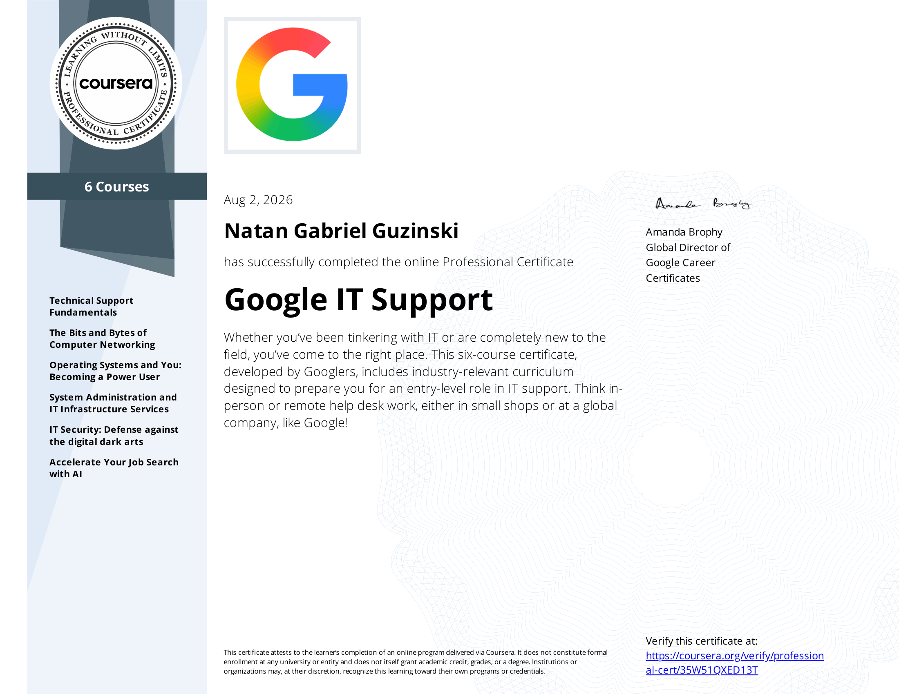
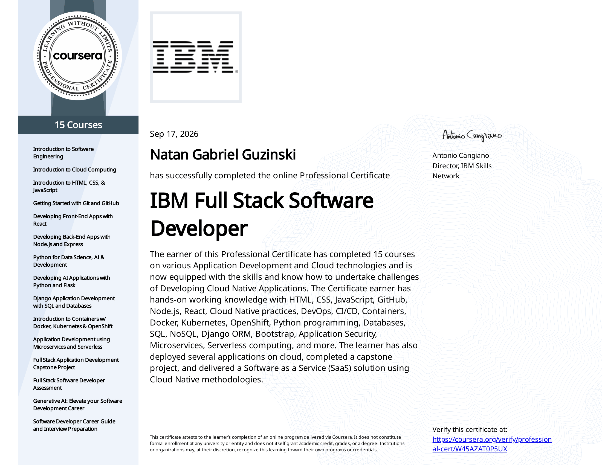

# Hi, I'm Natan Guzinski!

Computer Science student and self-taught developer, currently working toward a BSc in Computer Science with a specialization in Data Science at the University of London. Planning to continue on to a Master's in either Cybersecurity or Data Science after graduating.

I like building things end to end — from low-level systems work like writing my own programming language, to full-stack web applications, to running and maintaining my own home server infrastructure.

## Background

- Working toward a BSc in Computer Science (Data Science specialization), University of London
- Completed the Google IT Support Professional Certificate
- Completed the IBM Full Stack Software Developer Professional Certificate (React front-end, Node.js/Express back-end)
- Taught myself Calculus I and II independently, and have a passion for self-learning and improvement

  
  

## Featured Projects

### Oli-Nat Custom Programming Language
A statically typed, bytecode-VM programming language written from scratch in C. It includes a static type checker, a mark-and-sweep garbage collector, a standard library (I/O, math, file handling, type conversions, and more), and support for classes, functions, and closures. Built and tested cross-platform with GitHub Actions (Ubuntu and Windows/MSYS2).

Repository: https://github.com/NateTheGrappler/OliNat-Programming-Language

<!--
A short demo GIF goes a long way here — for example, compiling and running an
Oli-Nat script, or the garbage collector reclaiming memory. Record one with a
tool like ScreenToGif, Kap, or peek, save it under assets/gifs/, and embed it:

-->

### Oli-Nat Web Playground & Documentation
A companion documentation and playground site for the Oli-Nat language, built with React and Vite. It includes a live, in-browser code runner powered by WebAssembly, so visitors can write and execute Oli-Nat code directly on the site.

<!--

-->

### Self-Hosted Homelab: The **MidasCloud**
A personal cloud deployment running on Proxmox, hosted on repurposed desktop hardware with attached external storage — used as a hands-on way to apply systems administration and infrastructure management skills in practice.

## Skills

**Languages:** C, C++, Python, JavaScript, TypeScript, Java (working knowledge)

**Web & Full-Stack:** React, Node.js, Express, Flask, Django (working knowledge)

**Data:** SQL, NoSQL

**Systems & Tools:** Docker, Linux system administration, Proxmox, Git/GitHub, CI/CD (GitHub Actions), CMake

## Github Items:

<!-- Replace NateTheGrappler below with your actual GitHub username if it differs. These pull live from https://github.com/stats-organization/github-stats-extended, a maintained fork of github-readme-stats — same query parameters, just a different host. You can tweak theme/colors by adding params like &theme=default or &hide_border=true, or use the visual builder at https://github-stats-extended.vercel.app/frontend to generate a custom link. --> 
   

## Get in Touch

<!-- Add your preferred contact links here, e.g. LinkedIn, email, or a personal site -->